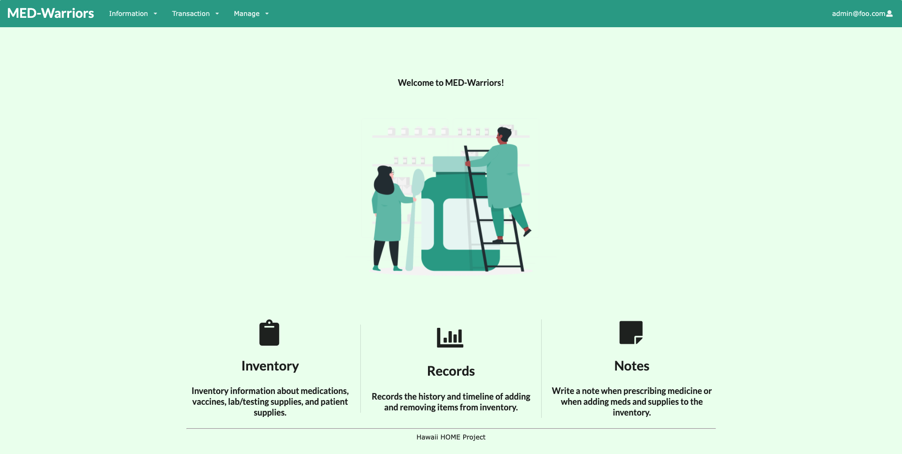

With my previous experience in ICS 314, I was excited to start off this semester with the Software Engineering II course. Going into this class, I was expecting it to be similar to what I have done before. And I was right. We are still working with Meteor, creating a web application in a project management system, and deploying it so it can be used in real life. But this time with more user feedback, more testing, and a fixed focus goal.

 

## Customer Client Meetings

 With ICS 414 I was exploring the main concepts that I learned before but on a deeper level. One of the main things being that we have a real customer now. This year our customer was the HOME project group that were a group of students, doctors, and volunteers that provide free medical care to the homeless. The goal of the project was to develop a real working web application for them to track, log, and dispense medicine and supplies. Having an actual customer allowed us to get constant feedback on changes they may want or suggestions they may have. That way the application is always under development and constantly making slight changes. Security questions like what services or access should certain users have from 314 were taken more seriously this time. We had to think about the details and work around the restrictions put in place for us. An example of this was when the idea of only hawaii.edu accounts could do certain tasks. Another thing was the UI. How the user interacts with the page is very important. We had to make the application easy to understand and easy to interact with. This was because they have a lot of students going in and out of the program and they wanted something anyone can pick up with very little training. 
 

Overall, I do not regret taking this class. It has been an interesting experience to see what a job in software engineering or development would be like. I’ve learned a lot about how we as programmers work with clients who may or may not know anything about programming and how to discuss the project to meet the goal. 

  
  
