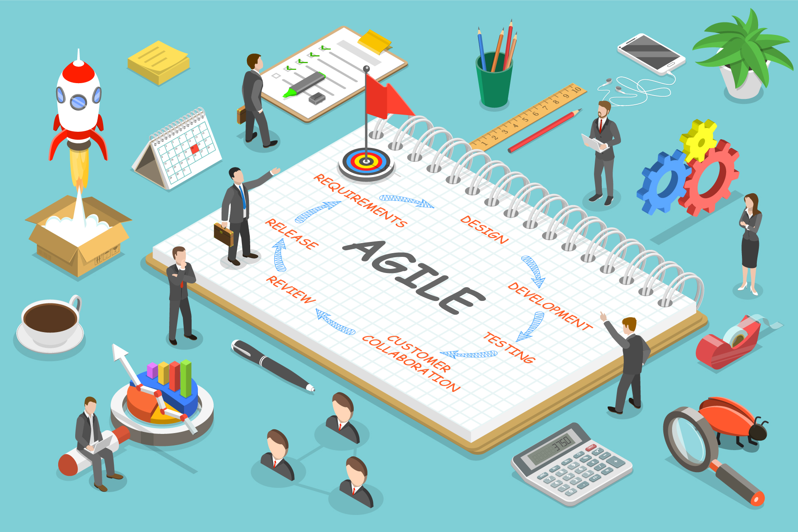

This year I started off completely unaware of the basics of Software Engineering. Never have I ever made a web application or even coded in Javascript. Completely thrown into the unknown, Software Engineering has been nothing but a delight to explore. It has brought me experience in not only creating web applications but developing professional project management environments and opened my eyes more to open source Software development.

 

## Agile Project Managment

  
The thing with managing software development is that you need to do it efficiently and in an adaptabile manner. In Software Development, there needs to be a reachable goal, testing, user feedback, and multiple fixes. It is a constant loop of improvement and can get confusing sometimes if you don't know what's the next step. Using something like GitHub's Project Board organizes and places the things that need to be done (milestones and issues) in a very organized and reachable place. You're able to communicate with your team members (if you're working in a group project) more effectively. Everyone who is involved in the project has full access to what is going on. 

Personally, I can see myself using this project management style for projects outside of web applications. In fact I see some similarities with my work. At the ITS Help Desk, we work with many different departments and people. It can get confusing very fast if everyone starts making changes on the same thing at the same time. We use a system called Cherwell where we can assign tickets to different groups of people. Just like the Project Board, there are options of putting down comments for people to see, the progression of the issue, and the assignment of the issue. I will definitely continue this style of management with future projects because it provided a big relief from the potential misunderstandings. 

## Open Source Software Development

This was not my first time experiencing the vast world of open source software development. I had in the past touched on some open source software here and there but have never actually realized how frequently and useful they are in programming. Not only are most of them free but they are easily accessible. Open source software allows the user to alter and make changes to the actual software code. This is great because you can learn how the thing works and use it for future ideas. Open source software also creates a lot of communities where people can share their modified code and the cool things they have found. With web development, the best way to learn how things work is to look at the code itself. From there you can alter it to fit your needs. Even outside of web development, having the code being widely distributed  can be one of the best ways to learn how certain programs and functions run. 

 

 

Looking back, I came into Software engineering barely knowing anything. After this year's learning experience I feel like I've just only got a taste. Developing web applications has taught me many tools and beneficial methods of working with programming, designing code, and project management. Knowing the necessities of how to develop a good application, I can use this knowledge for projects outside of web development. 

  
  
