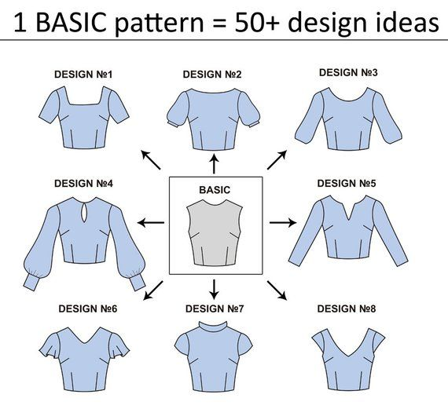
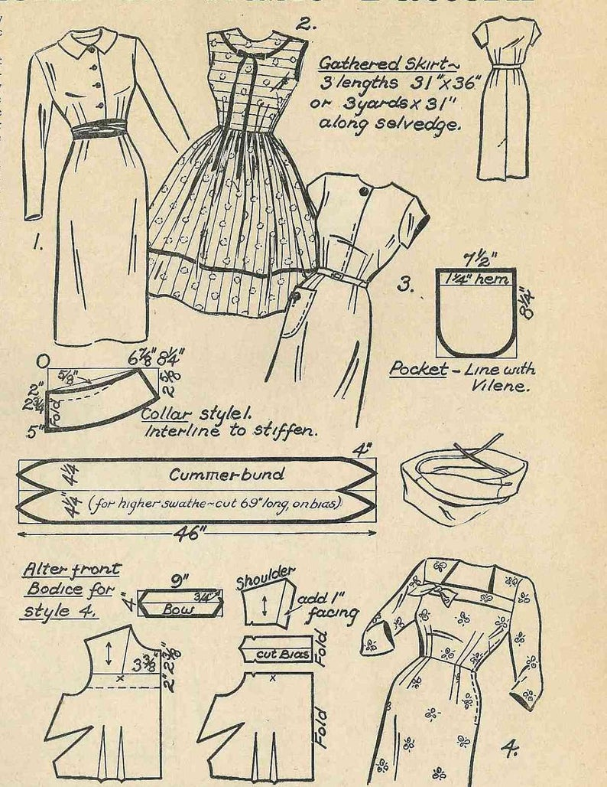

In fashion design, sewing patterns are shared, sold, and made as templates for people to create their own unique clothing pieces. Most often, patterns are cardboard cutouts meant to be traced onto the piece of cloth so that the designer has the basic shape and size to work with. 
 

Take a look at this basic pattern. This common form of stitching and placement can create various designs. The sleeves are all different, but the base of the top has the same form and fit. This outline is reusable to fit different types of styles and sizes. Just like in software programming design patterns can act as sewing patterns. Design patterns are reusable solutions to common problems you may face in programming. Reusability is an important asset when coding. Code that can be easily learned, picked up, and used for future programs is sought after. And just like sewing patterns, you can't just cut out and stitch the cloth pieces together. You need to cut, press, and hem in order to get the final fashion piece. Design patterns are not just straight code; you can copy and paste to fix your programming problems. It is used as a description or template of a potential solution. 

## Design Pattern Catalog

  
There are many different classifications for design patterns.

<h4>Behavioral Design Patterns</h4>

<ul>
  <li>Involves common communication patterns between objects</li>
  <li>Iterator</li>
   <li>State</li>
  <li>Command</li>
</ul>

<h4>Creational Design Patterns</h4>

<ul>
  <li>Object and Class creation mechanisms</li>
  <Li>Examples like:</li>
  <li>Singleton</li>
   <li>Adaptor</li>
  <li>Prototype</li>
</ul>

<h4>Structural Design Patterns</h4>

<ul>
  <li>Class and Object's composition relationship and inheritance</li>
   <Li>Examples like:</li>
  <li>Bridge</li>
   <li>Adaptor</li>
  <li>Composite</li>
</ul>

<h4>Concurrency Design Patterns</h4>

<ul>
  <li>Involves multi-thread programming</li>
  <li>Balking</li>
   <li>Active Object</li>
  <li>Thread Pool</li>
</ul>

## Editor's Choice

When using design patterns, you won't use just one or every single one. It's not one size fits all! Personally, I have only recently begun to incorporate them into my programs actively. Prototypes, which are a creational design pattern, is one of the most frequent outlines I use. It is extremely useful in the sense that it helps specify the kinds of objects to create. You are able to change certain parts of the objects and it is simple to clone the object to make more of it. This has definitely been a working solution for me and I look forward to using even more design patterns in my code.

  
