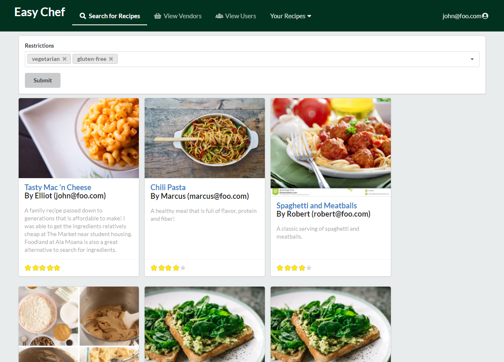
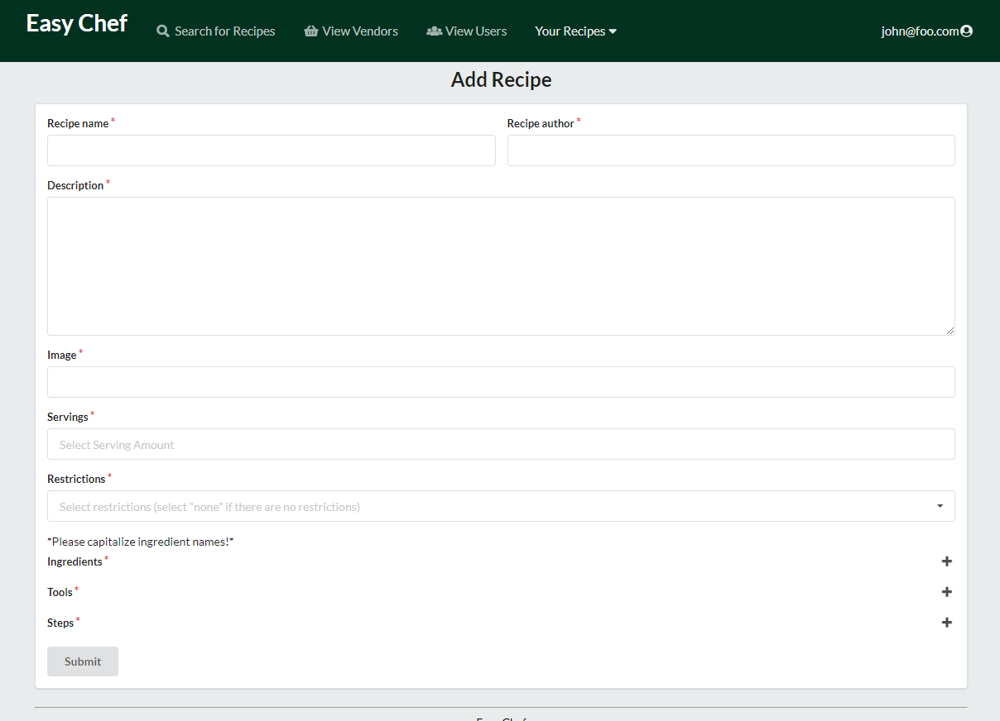

[EasyChef](https://easy-chef.github.io/) is a web application that provides pages to view and modify profiles, recipes, and vendors. The goal is provide an application that the UH community will use in order discover simple and affordable recipes for their meals including where to get its associated ingredients. It illustrates various technologies including:
<ul>
  <li>Meteor: Framework used for server and client code</li>
  <li>React: A Javascript library used to implement UI design</li>
  <li>Uniforms: Used to present and display form information when users create new items</li>
  <li>Semantic UI React: CSS framework within react to implement UI components</li>
</ul>

For college students, money is always of concern for anything including the meals that we prepare. Creating meals can be difficult for various reasons such as limited kitchen resources, cooking ability, and ingredient availability. No longer will a student simply resort to only a cup of noodles. With EasyChef, anyone can discover delicious recipes that is easy to make.

## Development

Being that this was my first group web application project, it was a fun learning experience. Our team of four constructed this web page to help broke college students discover new recipes and vendors. We had much work involving how database and collections worked and the different types of user permissions. On top of that, we had to consider how accessible the website is to a normal user and what functionality is needed. 

 

Here are some of the pages I was personally involved with:

 

<h4>Search Page</h4>

  

A page to search all recipes that has been posted to the application. Here, users can search by name and filter results based on dietary restrictions. The page will present a list of cards with recipes that meet the search results.

 

<h4>Search Page</h4>

  

A page to add recipes into the application for users to search and rate. Users can add options on dietary restrictions, estimated cost, tools needed, email contact, and instructions. This page is provides different types of fields for users to submit their recipe through the form. 

 

<h4>Admin Page</h4>

  

The admin home page is presented after a user logs-in with an account that “admin” role. Accounts with the “admin” role has an additional option in the navigation bar called “Admin” that allows one to view all items (users, recipes, vendors, etc.) in the system.

  

You can view the live deployment [here](https://easychef.xyz/#/).
  
