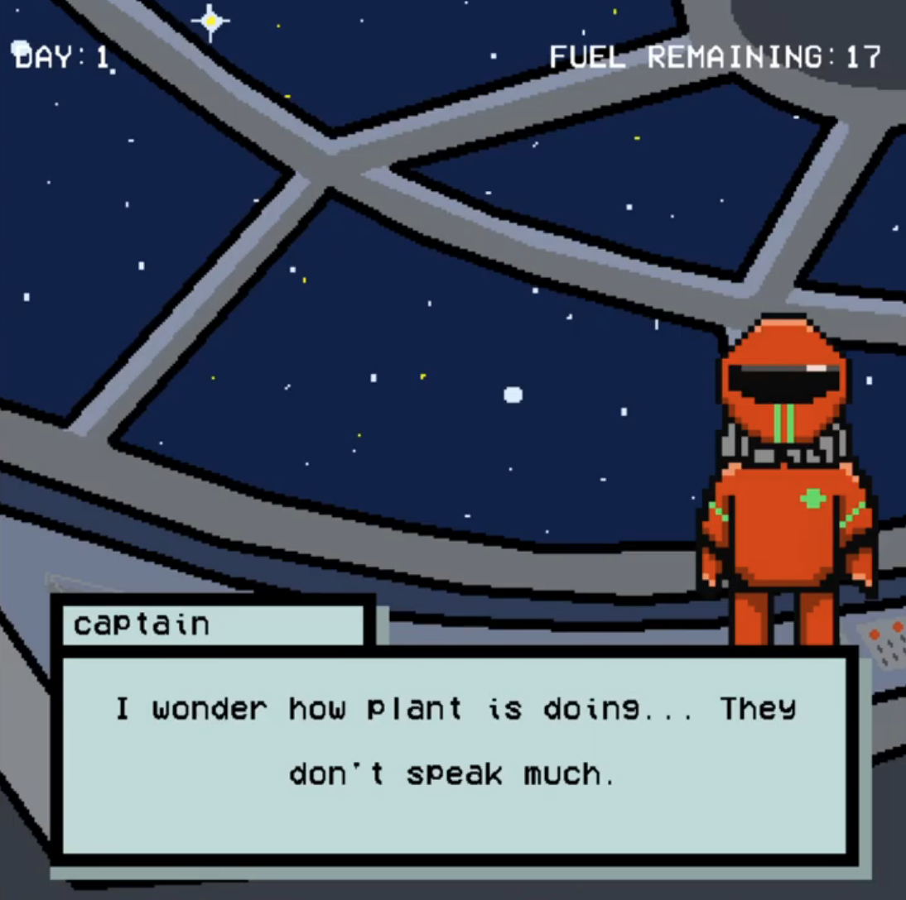
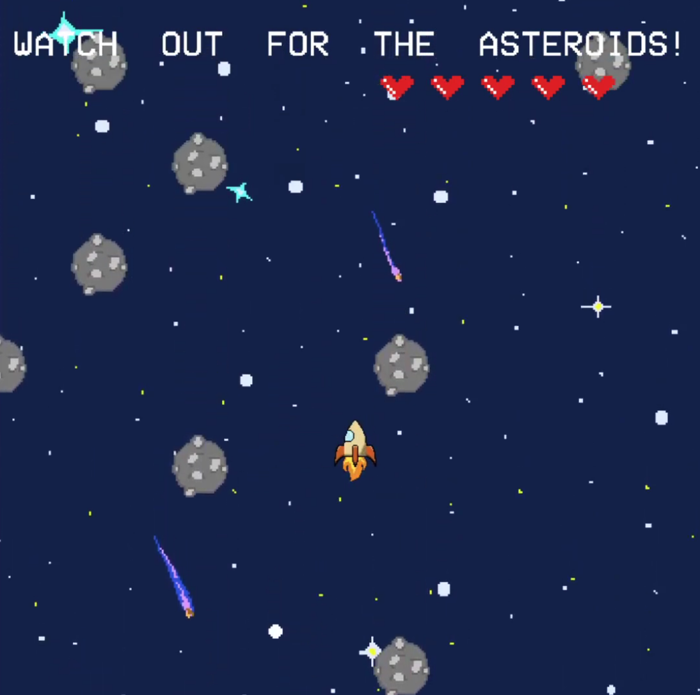

  
  
  
  

Homebound is a story text-based adventure game my classmate and I developed using Java and EZ Graphics (http://www2.hawaii.edu/~dylank/ics111/). Your consequences and choices hold heavy value. You will meet an array of characters with their own unique stories and go on to encounter mini games and puzzles along the way. The goal is to learn and ultimately choose what home means to you.

To give you a feeling of the game, here is an excerpt from the introduction:

<pre>
It's different for everyone
but the feeling is the same

There's a time when everyone must leave home
What's your reason?

Our home is dying 
and our fate lies in the hands 
of five unlikely heros..

</pre>

## The Learning Process

This was my first coding class. I had no previous experience with programming and was just starting to learn Java. I was eager to start this project because I love video games, art, and found coding to be super fun. The process of making this took around a month of going back and forth with my partner and communicating. It was nice to have done this with someone else because we were able to find solutions together, bring up new ideas, and provide useful insights. I learned how important it was to save your code and keep it stored somewhere safe. Throughout this project, I developed many habits that I still have today when coding (making use of comments, making your code readable, etc). I am glad to have Java as my starting language. This project of creating a video game gave me a better opportunity to learn and understand how object orientation worked because of the visual correlation. By using my previous knowledge of how video games worked, I was able to understand how an Object in programming worked. I felt like my learning process went so much smoother because I was able to connect the dots in my mind. If I altered something in my code, I could see it visually act out on my screen. I learned how important it was to think about ways to refine your code and make sure there are no bugs for the player to exploit.

You can view the walkthrough on [YouTube](https://www.youtube.com/watch?v=HSmw6Gjv2r0&feature=youtu.be&ab_channel=JustinY).

